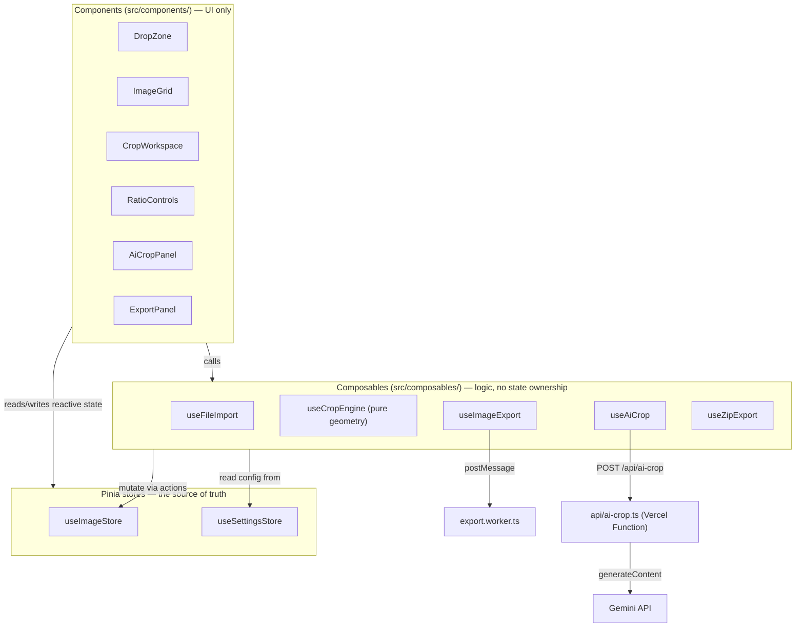
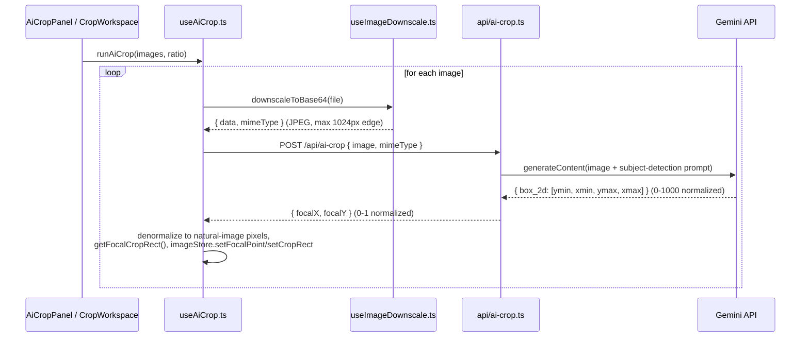

# Bulk Image Cropper

A client-side tool for bulk-importing images and cropping them to fixed ratios (1:1, 2:3, 3:2,
16:9), a custom ratio, or an exact pixel size — then exporting everything as a single ZIP.

Cropping, resizing, and encoding all run **locally in the browser** (off the main thread in a Web
Worker, so the UI stays responsive during large batch exports) — images are never uploaded
anywhere for this. The one exception is the optional **AI Crop** feature: only when you explicitly
click "AI Crop all images" is each image sent to Google's Gemini API (via a small serverless
proxy) to detect its main subject, so the ratio crop can be re-centered on it instead of the
image's geometric center. Nothing is sent automatically or on upload.

This doc is aimed at someone opening the repo for the first time — it explains what each piece of
the stack is *for*, how the pieces are wired together, and walks through what actually happens
when a user does each of the main things the app supports.

## Table of contents

- [Tech stack](#tech-stack)
- [Project structure](#project-structure)
- [Architecture](#architecture)
- [How the app is wired up](#how-the-app-is-wired-up)
- [Data flow walkthroughs](#data-flow-walkthroughs)
- [Key concepts to understand](#key-concepts-to-understand)
- [Getting started](#getting-started)
- [Testing](#testing)
- [Deployment](#deployment)
- [Extending the app](#extending-the-app)

## Tech stack

| Technology | What it's for here | Docs |
|---|---|---|
| **Vue 3** (`<script setup>`, Composition API) | UI framework. Every component in `src/components/` is a single-file component using `<script setup lang="ts">`. | [vuejs.org](https://vuejs.org/) · [`<script setup>` reference](https://vuejs.org/api/sfc-script-setup.html) |
| **TypeScript** | Type safety across app, Node config, and the API. Three separate `tsconfig.*.json` project references (see below) because the app, build tooling, and serverless API run in different environments. | [typescriptlang.org](https://www.typescriptlang.org/) |
| **Vite** | Dev server and production bundler for the client app. `npm run dev` runs Vite directly. | [vite.dev](https://vite.dev/) |
| **vue-tsc** | Type-checks `.vue` files (regular `tsc` can't parse SFCs). Runs as part of `npm run build`. | [vuejs/language-tools](https://github.com/vuejs/language-tools) |
| **Pinia** | Global state management — two stores (`useImageStore`, `useSettingsStore`) hold everything components read and mutate. | [pinia.vuejs.org](https://pinia.vuejs.org/) |
| **Sass** | Styling. Each component has a `<style scoped lang="scss">` block; shared tokens (colors, spacing) live in `src/assets/styles/_variables.scss`. | [sass-lang.com](https://sass-lang.com/) |
| **JSZip** | Bundles the exported image blobs into a single downloadable `.zip`. Used only in `useZipExport.ts`. | [stuk.github.io/jszip](https://stuk.github.io/jszip/) |
| **Vitest** + **@vue/test-utils** | Test runner (Vite-native, Jest-compatible API) and component-mounting helpers. Runs in a `jsdom` environment (configured in `vite.config.ts`). | [vitest.dev](https://vitest.dev/) · [test-utils.vuejs.org](https://test-utils.vuejs.org/) |
| **Vercel** (`@vercel/node`, Vercel CLI) | Hosting platform. The static build deploys as-is; `api/ai-crop.ts` deploys as a Vercel Function (serverless). `vercel dev` is needed locally to exercise that function. | [vercel.com/docs](https://vercel.com/docs) · [Vercel Functions](https://vercel.com/docs/functions) |
| **Gemini API** (`gemini-3.5-flash-lite`) | The actual AI behind "AI Crop" — given a downscaled image, returns a bounding box for the most visually prominent subject. Called server-side only, from `api/ai-crop.ts`. | [ai.google.dev/gemini-api/docs](https://ai.google.dev/gemini-api/docs) |
| **Web Workers** / **OffscreenCanvas** (browser APIs, no package) | `src/workers/export.worker.ts` draws each crop onto an `OffscreenCanvas` off the main thread and returns a `Blob`, so exporting hundreds of images doesn't freeze the UI. | [Web Workers API](https://developer.mozilla.org/en-US/docs/Web/API/Web_Workers_API) · [OffscreenCanvas](https://developer.mozilla.org/en-US/docs/Web/API/OffscreenCanvas) |
| **Pointer Events** (browser API, no package) | Pan/resize interactions on the crop overlay in `CropWorkspace.vue` use `pointerdown`/`pointermove`/`pointerup` + `setPointerCapture`, not mouse events, so drag works uniformly across mouse, touch, and pen. | [Pointer Events](https://developer.mozilla.org/en-US/docs/Web/API/Pointer_events) |

No UI component library, no CSS framework, no router — this is intentionally a small, dependency-light app.

## Project structure

```
api/
  ai-crop.ts          # Vercel Function: POST /api/ai-crop — validates input, calls Gemini, returns a focal point
  _lib/gemini.ts       # Gemini prompt + response-parsing logic (unit-tested independent of the network call)

src/
  main.ts              # App entry point — creates the Vue app, installs Pinia, mounts #app
  App.vue               # Root component — layout shell + the ratio-change watcher that re-applies crops to every image

  stores/
    useImageStore.ts    # Source of truth for imported images: list, active selection, crop rects, statuses
    useSettingsStore.ts # Source of truth for batch-wide crop ratio + export config

  composables/           # Framework-agnostic-ish logic, reusable across components
    useCropEngine.ts      # Pure geometry: compute/pan/resize crop rectangles (no Vue, no DOM)
    useFileImport.ts       # Turns dropped/picked File objects into ImportedImage records
    useAiCrop.ts            # Orchestrates the AI Crop network flow across one or many images
    useImageDownscale.ts    # Downscales + base64-encodes an image client-side before sending to the API
    useImageExport.ts        # Spins up the export Web Worker and runs crop/resize/encode jobs through it
    useZipExport.ts           # Bundles exported blobs into a .zip via JSZip and triggers the download
    useFilenameSanitize.ts     # Slugifies filenames for safe, deduped zip entries
    useObjectUrls.ts            # Tracks and revokes blob: object URLs to avoid leaking memory
    useToast.ts                  # Tiny global toast/notification queue

  components/                 # App.vue's direct children:
    DropZone.vue               # Drag-and-drop / click-to-browse file picker
    ImageGrid.vue              # Left sidebar: thumbnail list of imported images
    ImageGridItem.vue          # One thumbnail row (select / remove / status indicators)
    CropWorkspace.vue          # Center panel: the big image + draggable/resizable crop overlay
    CropHandle.vue             # The resize-handle dot rendered on the crop overlay
    RatioControls.vue          # Right panel: ratio presets / custom ratio / custom px inputs
    AiCropPanel.vue            # Right panel: "AI Crop all images" button + progress
    ExportPanel.vue            # Right panel: format/quality selectors + "Export" button
    ToastNotification.vue      # Renders the toast queue from useToast
    IconButton.vue             # Small shared icon-button wrapper

  workers/
    export.worker.ts       # Runs inside the Web Worker: crop + resize + encode one image to a Blob

  types/                    # Shared TS types: ImportedImage/CropRect (image.ts), ratio modes (ratio.ts), OutputFormat (export.ts)

  assets/styles/            # _variables.scss (design tokens) + main.scss (global styles)

tests/
  api/gemini.test.ts               # Unit tests for Gemini response parsing (no network)
  composables/useCropEngine.test.ts
  composables/useImageDownscale.test.ts
  composables/useFilenameSanitize.test.ts
  components/DropZone.test.ts
  components/RatioControls.test.ts
```

### Why three `tsconfig` files?

`tsconfig.json` is a root that just references three project configs — `app` (browser code in
`src/`), `node` (Vite config itself), and `api` (the Vercel Function in `api/`, which runs on
Node, not in the browser, and must not pull in DOM-only types by accident). `npm run build` runs
`vue-tsc -b`, which type-checks all three via that reference graph.

## Architecture

Three layers, each with one job:



- **Components** hold almost no state of their own. They read from the two Pinia stores and call
  composable functions in response to user interaction (click, drag, drop).
- **Composables** are where the actual logic lives — importing files, running the AI crop
  network flow, exporting. Most of them import the store directly (`useImageStore()`,
  `useSettingsStore()`) rather than having state passed in, since Pinia stores are safe to call
  from anywhere once `main.ts` installs the Pinia plugin.
- **`useCropEngine.ts`** is the one composable that's *pure* — plain functions taking/returning
  numbers and `CropRect` objects, no Vue imports, no store access. That's deliberate: it's the
  crop math, and keeping it framework-free makes it trivial to unit test and reuse (it's called
  from `useFileImport`, `useAiCrop`, `App.vue`, and `CropWorkspace.vue`).
- **Stores** own state and the handful of mutations that touch it (`setCropRect`, `setStatus`,
  `applyToAll`, etc.). Both are written with Pinia's [setup-store syntax](https://pinia.vuejs.org/core-concepts/#setup-stores)
  (`ref`/`computed` inside `defineStore(id, () => {...})`), which is just the Composition API
  applied to global state — if you know `ref`/`computed`, you already know how to read these.

## How the app is wired up

`src/main.ts` creates the Vue app, calls `app.use(createPinia())`, and mounts `App.vue` into
`#app` in `index.html`. From there:

- **`App.vue`** is the layout shell (`DropZone` when empty, otherwise `ImageGrid` +
  `CropWorkspace` + the right-hand panel of `RatioControls`/`AiCropPanel`/`ExportPanel`), plus one
  important piece of glue logic: a `watch` on `settingsStore.ratio` that re-applies a crop rect to
  *every* imported image whenever the ratio changes (see `App.vue:20-29`). This is the mechanism
  that makes "change the ratio once, it updates the whole batch" work.
- Every other component talks to state exclusively through `useImageStore()` /
  `useSettingsStore()` — there's no prop-drilling of image data through the tree.

### The two stores in detail

**`useImageStore`** (`src/stores/useImageStore.ts`) — the list of `ImportedImage` and which one is
currently selected (`activeImageId`). Each `ImportedImage` (`src/types/image.ts`) carries:

```ts
{
  id, file, name, url,              // identity + the blob: object URL for 
  naturalWidth, naturalHeight,      // true pixel dimensions, decoded on import
  cropRect: CropRect | null,        // current crop, in natural-image pixel space
  status: 'ready' | 'exporting' | 'done' | 'error',
  focalPoint: { x, y } | null,      // AI-detected subject center, in natural-image pixels
  aiCropStatus: 'idle' | 'analyzing' | 'done' | 'error',
}
```

**`useSettingsStore`** (`src/stores/useSettingsStore.ts`) — the batch-wide crop configuration.
`mode` picks between `preset` / `custom-ratio` / `custom-px`; `ratio` and `outputSize` are
`computed()` from whichever raw inputs are active. Also holds export `outputFormat` and `quality`.

## Data flow walkthroughs

### 1. Importing images

`DropZone.vue` → `useFileImport().importFiles(fileList)`:

1. Filters to accepted MIME types (jpeg/png/webp/gif/bmp).
2. For each accepted file: decodes it in a throwaway `` to read `naturalWidth`/`naturalHeight`,
   creates a `blob:` object URL (`useObjectUrls.ts`, tracked so it can be revoked later), and
   computes an initial `cropRect` centered on the image via `getCenteredCropRect` using the
   *current* `settingsStore.ratio`.
3. Calls `imageStore.addImages(...)` — the first imported image becomes `activeImageId`
   automatically.
4. Shows a success/error toast via `useToast()`.

### 2. Changing the crop ratio

`RatioControls.vue` writes to `settingsStore.mode`/`presetIndex`/`customRatioWidth`/etc. →
`settingsStore.ratio` (a `computed`) changes → the `watch` in `App.vue` fires →
`imageStore.applyToAll(...)` recomputes every image's `cropRect`:

- If the image has a `focalPoint` (from a prior AI Crop), it stays centered on that point via
  `getFocalCropRect`.
- Otherwise it falls back to the geometric center via `getCenteredCropRect`.

"Reset all image crops" (`RatioControls.vue::resetCropCenter`) explicitly clears every
`focalPoint` first (`clearFocalPoints`), so images fall back to dead-center.

### 3. Manually adjusting one image's crop

`CropWorkspace.vue` renders the active image plus an absolutely-positioned overlay `<div>` sized
from `image.cropRect`, scaled into screen pixels via `displayScale`/`imageOffset` (see
[coordinate spaces](#coordinate-spaces-natural-vs-screen-pixels) below).

- **Pan**: pointer-down on the overlay records the starting pointer position and the rect's
  origin; pointer-move computes a delta in *natural* pixels (`dx = screenDx / displayScale`) and
  calls `panCropRect` (clamped to image bounds), writing the result via
  `imageStore.setCropRect`.
- **Resize**: pointer-down on `CropHandle.vue` records the starting rect; pointer-move calls
  `resizeCropRect`, which grows/shrinks the rect around its own center while locking to the
  current ratio.

Both use native [Pointer Events](https://developer.mozilla.org/en-US/docs/Web/API/Pointer_events)
with `setPointerCapture` so the drag keeps working even if the pointer leaves the element.

### 4. AI Crop

Triggered per-image (`CropWorkspace.vue`'s "AI Crop" button) or for the whole batch
(`AiCropPanel.vue`'s "AI Crop all images"), both calling `runAiCrop()` from `useAiCrop.ts`:



Key detail: this doesn't crop *tightly* to the subject — it computes the same size crop
`getCenteredCropRect` would have produced, just re-centered on the detected subject via
`getFocalCropRect`. The `GEMINI_API_KEY` is read server-side only in `api/ai-crop.ts`
(`process.env.GEMINI_API_KEY`) — it's never exposed to client code, and must never be prefixed
`VITE_` (that prefix tells Vite to bundle a var into client JS).

### 5. Export

`ExportPanel.vue` ("Export" = whole batch) or `CropWorkspace.vue` ("Export" = active image only)
call `exportImages()` from `useImageExport.ts`:

1. Spins up **one** `export.worker.ts` Web Worker for the whole run.
2. For each image (sequentially, not in parallel, to keep the UI responsive rather than maximize
   throughput): decodes it to an `ImageBitmap`, copies `cropRect`/`outputSize` into plain
   objects (Pinia's reactive proxies can't survive `structuredClone` over `postMessage`), and
   posts a job to the worker — transferring the bitmap (`postMessage(job, [job.bitmap])`) rather
   than copying it.
3. The worker draws the crop onto an `OffscreenCanvas` sized to the target output, encodes it to a
   `Blob` in the selected format/quality, and posts it back.
4. Once all jobs resolve, `buildAndDownloadZip()` (`useZipExport.ts`) adds every blob to a
   `JSZip` instance (deduping filenames that collide), generates the zip as a `Blob`, and triggers
   a browser download via a temporary `<a download>` element.

## Key concepts to understand

### Coordinate spaces: natural vs. screen pixels

Every `CropRect` stored in Pinia (`cropRect`, `focalPoint`) is in **natural-image pixel space** —
the image's actual decoded width/height, independent of how large it's rendered on screen. This is
what `useCropEngine.ts` operates on exclusively.

`CropWorkspace.vue` is the only place that converts between spaces: `displayScale = img.clientWidth
/ image.naturalWidth` and `imageOffset` (to account for the `` being letterboxed/centered in
its flex container). Screen-space pointer deltas get divided by `displayScale` before being fed
back into the natural-space crop math, and the overlay's CSS position/size is `cropRect` values
multiplied by `displayScale`. If you're debugging a crop-overlay-drift bug, this is almost always
where to look first.

### Object URL lifecycle

`URL.createObjectURL()` (used for both image thumbnails and the final zip download) leaks memory
if never revoked. `useObjectUrls.ts` wraps creation in a small registry so every URL created via
`createObjectUrl()` can be revoked with `revokeObjectUrl()` — `useImageStore`'s `removeImage` and
`clearAll` already call this on every image they drop, so you generally don't need to think about
it unless you're adding a new place that creates one.

### Reactive state can't cross a `postMessage` boundary

Pinia state is wrapped in Vue reactivity proxies, which `structuredClone` (used internally by
`postMessage`) can't serialize. `useImageExport.ts` copies `cropRect`/`outputSize` into plain
object literals before posting to the worker — if you add a new field to `ImportedImage` that
needs to reach the worker, remember to do the same.

### Pinia setup stores

Both stores use the function-style `defineStore('id', () => { ... return {...} })` form rather
than the options-style `defineStore('id', { state, actions })` form. Functionally equivalent, but
means store code reads like a composable: `ref()` for state, `computed()` for derived state, plain
functions for actions, and everything returned is what's exposed on the store instance.

## Getting started

```sh
npm install
npm run dev          # Vite dev server only — does NOT serve /api/* (AI Crop will fail)
npm run dev:vercel   # vercel dev — serves the app AND /api/ai-crop, required to test AI Crop locally
npm run build        # vue-tsc -b (type-check) + vite build
npm run test         # vitest run (single run)
npm run test:watch   # vitest watch mode
```

Run a single test file:

```sh
npx vitest run tests/composables/useCropEngine.test.ts
```

### Local AI Crop setup

`npm run dev` is enough for everything *except* AI Crop, since a plain Vite dev server doesn't
know how to serve `/api/*` Vercel Functions. To exercise AI Crop locally you need `vercel dev`
instead, which requires linking this repo to a Vercel project once:

```sh
npx vercel link                                # once, links this repo to a Vercel project
npx vercel env add GEMINI_API_KEY development   # paste your dev Gemini key when prompted
npm run dev:vercel                              # now serves both the app and /api/ai-crop
```

`vercel dev` pulls environment variables from the **linked Vercel project's** settings, not from
this repo's local `.env` file — that's why the key has to be registered with `vercel env add`
rather than just dropped into `.env`. Get a Gemini API key at
[aistudio.google.com/apikey](https://aistudio.google.com/apikey).

## Testing

Tests run under Vitest with a `jsdom` environment (`vite.config.ts`). What's currently covered:

- `tests/composables/useCropEngine.test.ts` — the pure crop-geometry functions.
- `tests/composables/useImageDownscale.test.ts` — downscale dimension math.
- `tests/composables/useFilenameSanitize.test.ts` — filename slugification.
- `tests/api/gemini.test.ts` — Gemini response parsing (`parseGeminiResponse`), tested in
  isolation from the network call — this is why `api/_lib/gemini.ts` is split out from
  `api/ai-crop.ts` in the first place.
- `tests/components/DropZone.test.ts`, `tests/components/RatioControls.test.ts` — component
  behavior via `@vue/test-utils`.

There's no separate lint script; `vue-tsc -b` (via `npm run build`) is the primary static check,
type-checking all three `tsconfig` project references.

## Deployment

Deploys to Vercel. The static Vite build itself needs zero configuration; the AI Crop feature adds
one serverless function (`api/ai-crop.ts`), which requires a `GEMINI_API_KEY` environment variable
set on the Vercel project (Project → Settings → Environment Variables, or
`vercel env add GEMINI_API_KEY production`). Without that variable, the rest of the app still
works — AI Crop just returns a clear error toast instead of a focal point.

`GEMINI_MODEL` (`api/_lib/gemini.ts`) pins the specific Gemini model used — flash-lite model names
have been retired/renamed before, so if AI Crop starts failing after a deploy, that's one of the
first things to check against the [current Gemini model list](https://ai.google.dev/gemini-api/docs/models).

## Extending the app

**Adding a new ratio/crop mode** touches, in order:

1. `src/types/ratio.ts` — extend `RatioMode` or `RatioPreset` as needed.
2. `src/stores/useSettingsStore.ts` — add the new state and wire it into the `ratio`/`outputSize`
   computeds.
3. `src/components/RatioControls.vue` — add the UI control.
4. `src/composables/useCropEngine.ts` — only if the new mode needs geometry that
   `getCenteredCropRect`/`getFocalCropRect` can't already express.

**Adding a new export format**: extend `OutputFormat` in `src/types/export.ts`, add it to the
`<select>` in `ExportPanel.vue`, and add a case in `extensionForFormat` (`useFilenameSanitize.ts`).
The worker itself (`export.worker.ts`) already accepts any MIME type `OffscreenCanvas.convertToBlob`
supports — no worker changes needed.

**Adding a field to `ImportedImage`**: remember the [postMessage caveat](#reactive-state-cant-cross-a-postmessage-boundary)
if the export worker needs to see it, and that `useObjectUrls.ts` needs to know about any new
object URL you create so it gets revoked.
